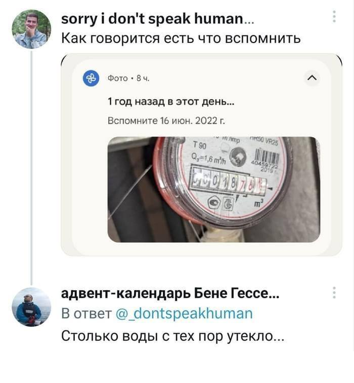
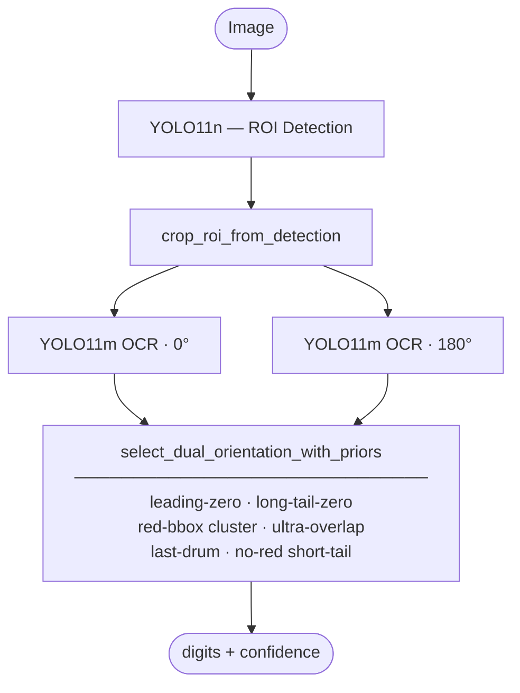
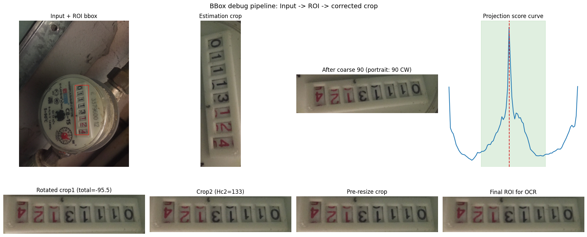
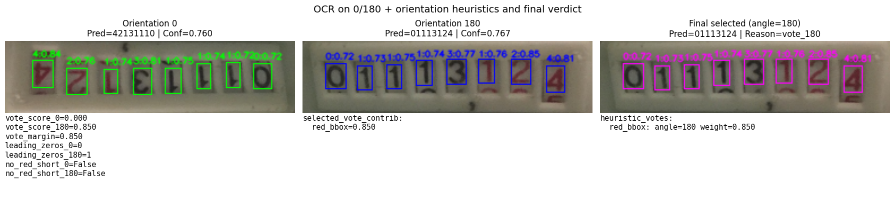
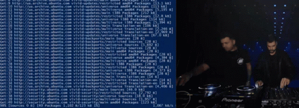

<div align="center">

# 💧 WaterMeterCV

**CV-пайплайн для извлечения цифр с фотографии водосчётчика**

*Вход — JPEG/PNG с меткой счётчика &nbsp;·&nbsp; Выход — строка цифр и confidence*

[](https://www.python.org/)
[](LICENSE)
[](docker/)
[](https://fastapi.tiangolo.com/)
[](https://hub.docker.com/r/urran/watermetercv)



</div>

---

## Оглавление

- [💧 WaterMeterCV](#-watermetercv)
  - [Оглавление](#оглавление)
  - [Статус и метрики](#статус-и-метрики)
  - [Пайплайн](#пайплайн)
  - [Quick Start](#quick-start)
    - [0. Docker Hub — без сборки (быстрый старт для тестирования)](#0-docker-hub--без-сборки-быстрый-старт-для-тестирования)
    - [1. Локально (uv) — для разработки](#1-локально-uv--для-разработки)
    - [2. Docker — CPU (локальная сборка)](#2-docker--cpu-локальная-сборка)
    - [3. Docker — GPU (локальная сборка)](#3-docker--gpu-локальная-сборка)
  - [API](#api)
    - [`POST /recognize`](#post-recognize)
    - [`POST /predict`](#post-predict)
    - [`GET /healthz` · `GET /info`](#get-healthz--get-info)
  - [Конфигурация](#конфигурация)
  - [Разработка и research](#разработка-и-research)
  - [Лицензия](#лицензия)

---

## Статус и метрики

Research-фаза завершена — выигравший пайплайн зафиксирован и упакован в FastAPI-сервис.


| Метрика | Значение | Модель |
|---|---|---|
| ROI IoU (WaterMeterDataset, test) | **0.94** | YOLO11n |
| ROI detection rate | **100 %** | YOLO11n |
| OCR FSA norm (test split) | **87.7 %** | YOLO11m |
| Inference time (CPU, warm) | **~36 ms / фото** | YOLO11m |


---

## Пайплайн




> [!NOTE]
> Канонические эвристики и параметры прайоров/приоритетов —
> [`Notebooks/03_ocr/00_pretrained_ocr_yolo11m.ipynb`](Notebooks/03_ocr/00_pretrained_ocr_yolo11m.ipynb).
> Детали ROI-исследования — [`docs/notes/roi-detection-findings.md`](docs/notes/roi-detection-findings.md).

---

## Quick Start

Четыре сценария — во всех поднимается HTTP-сервер на `:8000`, основной endpoint `POST /recognize`.

### 0. Docker Hub — без сборки (быстрый старт для тестирования)

```bash
# CPU
docker pull urran/watermetercv:cpu
docker run --rm -p 8000:8000 urran/watermetercv:cpu

# GPU (нужен nvidia-container-toolkit)
docker pull urran/watermetercv:gpu
docker run --rm --gpus all -p 8000:8000 urran/watermetercv:gpu
```

```bash
# Проверка
curl http://localhost:8000/healthz
# {"status":"ok"}

curl -F "file=@meter.jpg" http://localhost:8000/recognize
# {"value": 17688}
```

### 1. Локально (uv) — для разработки

```bash
# CPU
uv sync --extra service
uv run watermetercv-serve

# GPU (CUDA 13.0)
uv sync --extra service --extra cuda
WATERMETERCV_DEVICE=cuda:0 uv run watermetercv-serve
```

### 2. Docker — CPU (локальная сборка)

```bash
docker build -f docker/Dockerfile.cpu -t watermetercv:cpu .
docker run --rm -p 8000:8000 watermetercv:cpu
```

### 3. Docker — GPU (локальная сборка)

> [!TIP]
> На хосте нужен [`nvidia-container-toolkit`](https://docs.nvidia.com/datacenter/cloud-native/container-toolkit/install-guide.html).


```bash
docker build -f docker/Dockerfile.gpu -t watermetercv:gpu .
docker run --rm --gpus all -p 8000:8000 watermetercv:gpu
```

<details>
<summary><b>Через docker compose</b></summary>



```bash
docker compose -f docker/docker-compose.yml --profile cpu up --build
docker compose -f docker/docker-compose.yml --profile gpu up --build
```

</details>

---

## API

### `POST /recognize`

Основной эндпойнт для бэкенд-интеграции — совместим с `meter-backend/RecognitionController` (multipart `file` → `Map<String, Integer>`).

```bash
curl -F "file=@meter.jpg" http://localhost:8000/recognize
```

```json
{"value": 123456}
```

### `POST /predict`

Internal / debug эндпойнт: отдаёт строку цифр с ведущими нулями + confidence. Используется нашим bench-скриптом.

```bash
curl -F "image=@meter.jpg" http://localhost:8000/predict
```

```json
{"digits": "00123456", "confidence": 0.87}
```

### `GET /healthz` · `GET /info`

```bash
curl http://localhost:8000/healthz
# {"status":"ok"}

curl http://localhost:8000/info
# {"roi_model":"wm_yolo_roi_20260412_230832","ocr_model":"yolo11m_20260414_194809","device":"cpu"}
```

| Код | Причина |
|---|---|
| `200` | OK |
| `400` | Битое или пустое изображение |
| `413` | Файл больше 10 MB |
| `422` | Нет поля `file` / `image` — или для `/recognize` пайплайн не нашёл цифр |
| `500` | Внутренняя ошибка |
| `503` | Pipeline ещё не готов |

Полный контракт и рекомендации по интеграции — [`docs/service.md`](docs/service.md).

---

## Конфигурация

Переменные окружения (все опциональные; в Docker-образах выставлены по умолчанию):

| Переменная | Назначение | Default |
|---|---|---|
| `WATERMETERCV_ROI_WEIGHTS` | путь к `.pt` весам ROI-модели | `models/weights/roi_yolo/.../best.pt` |
| `WATERMETERCV_OCR_WEIGHTS` | путь к `.pt` весам OCR-модели | `models/weights/baseline_yolo/yolo11m_.../best.pt` |
| `WATERMETERCV_DEVICE` | `cpu` / `cuda:0` | `cpu` (в GPU-образе `cuda:0`) |
| `WATERMETERCV_HOST` | bind host | `0.0.0.0` |
| `WATERMETERCV_PORT` | bind port | `8000` |

---

## Разработка и research

```
WaterMeterCV/
├── Notebooks/          # 00 EDA → 01 baseline → 02 ROI → 03 OCR → 04 combinations
├── models/
│   ├── data/           # unified dataset loaders, crop/warp helpers
│   ├── metrics/        # FSA, CER, IoU, inference time
│   └── utils/          # visualization, orientation (dual_read_inference)
├── src/watermetercv/   # inference-only пакет сервиса
│   ├── ocr/            # heuristics, predictor, priors
│   ├── roi/            # yolo_roi detector wrapper
│   └── service/        # FastAPI app + schemas
├── docker/             # Dockerfile.cpu · Dockerfile.gpu · docker-compose.yml
├── scripts/            # bench_service, debug_bbox_crop, visualization
├── configs/            # default.yaml — гиперпараметры
├── results/            # метрики JSON/CSV
└── tests/              # unit + integration (TestClient)
```

```bash
# Запуск тестов
uv run pytest tests/ -v

# Service regression bench
uv run watermetercv-serve &
python scripts/bench_service.py --url http://localhost:8000 --tag cpu
```

Остальные соглашения (git-workflow, Colab, структура датасетов) — [`CLAUDE.md`](CLAUDE.md).

---

## Лицензия

[](LICENSE)

Код и веса моделей — **[AGPL-3.0](LICENSE)**.

> [!WARNING]
> 
> 
> Учебный проект. ROI-детектор обучен на датасете под **CC BY-NC-ND 4.0**
> (Kucev Roman / tapakah68, Kaggle) — **коммерческое использование запрещено**
> без отдельного лицензионного гранта или замены ROI-весов.
> Полный список атрибуций — [`NOTICE.md`](NOTICE.md).
