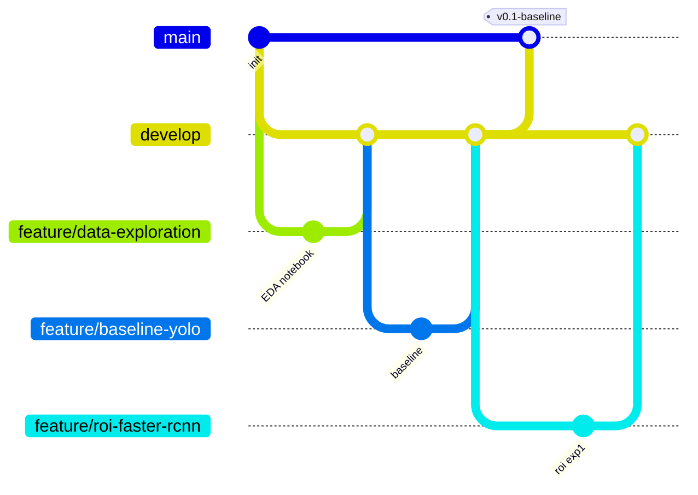

# WaterMeterCV — ML Research Plan Design Spec

## Goal

Последовательно протестировать 11 ML-подходов для считывания показаний водяных счётчиков с фотографий. Выбрать лучший пайплайн по совокупности метрик.

## Datasets

### `WaterMetricsDATA/waterMeterDataset/WaterMeters/`
- **images/** — фото счётчиков
- **masks/** — маски
- **collage/** — коллажи
- **data.csv** — ground truth: `photo_name`, `value` (число), `location` (полигон ROI в нормализованных координатах)

### `WaterMetricsDATA/utility-meter-reading-dataset-for-automatic-reading-yolo.v4i/`
- Доступен в COCO и YOLOv11 форматах
- 14 классов: цифры 0-9, `Reading Digit`, `black`, `red`, `white`
- train/valid/test splits
- ROI ground truth: COCO JSON-аннотации (`.coco` вариант) или YOLO `.txt` label-файлы (`.yolov11` вариант)

### Унификация
В `00_data_exploration` создаётся унифицированный loader, приводящий оба формата к единому представлению для расчёта метрик.

---

## File Structure

```
WaterMeterCV/
├── Notebooks/
│   ├── 00_data_exploration.ipynb
│   ├── 01_baseline/
│   │   └── yolo_single_stage.ipynb
│   ├── 02_roi_detection/
│   │   ├── faster_rcnn.ipynb
│   │   ├── yolo_roi.ipynb
│   │   └── segmentation_unet.ipynb
│   ├── 03_ocr/
│   │   ├── crnn_ctc.ipynb
│   │   ├── transformer_ocr.ipynb
│   │   ├── cnn_ctc.ipynb
│   │   └── per_digit_classifier.ipynb
│   └── 04_combinations/
│       ├── craft_crnn.ipynb
│       ├── maskrcnn_decoder.ipynb
│       └── detectron2_ocr.ipynb
├── models/
│   ├── data/               # DataLoader'ы, конвертация форматов, аугментации
│   ├── metrics/            # Единые метрики (full-string acc, per-digit acc, CER, IoU, inference time)
│   ├── utils/              # Визуализация предсказаний, логирование результатов
│   ├── weights/            # Сохранённые веса .pt (gitignored)
│   └── checkpoints/        # Чекпоинты обучения (gitignored)
├── src/                    # FastAPI, сервисный слой (будущее, вне скоупа текущей спеки)
├── configs/                # YAML-конфиги экспериментов (гиперпараметры, пути к данным)
├── results/                # Метрики, графики, comparison.md
├── WaterMetricsDATA/       # Датасеты (gitignored)
├── docs/
│   └── notes/              # Существующие заметки по архитектуре
├── CLAUDE.md
├── pyproject.toml
└── .gitignore
```

### gitignore additions
```
models/weights/
models/checkpoints/
```

---

## Git Workflow (GitFlow-lite)

### Branches
- **main** — стабильная версия, только через PR из `develop`
- **develop** — интеграционная ветка
- **feature/\<name\>** — по одной на каждый эксперимент/задачу

### Feature branch naming
```
feature/data-exploration
feature/baseline-yolo
feature/roi-faster-rcnn
feature/roi-yolo
feature/roi-segmentation
feature/ocr-crnn-ctc
feature/ocr-transformer
feature/ocr-cnn-ctc
feature/ocr-per-digit
feature/combo-craft-crnn
feature/combo-maskrcnn-decoder
feature/combo-detectron2-ocr
```

### Rules
1. Каждый ноутбук-эксперимент = отдельная feature-ветка
2. Общий код в `models/data/`, `models/metrics/`, `models/utils/` коммитится в той ветке, где впервые понадобился
3. Conventional commits: `feat:`, `fix:`, `refactor:`, `docs:`
4. Мерж в `develop` через PR
5. `develop` → `main` после завершения логической группы (например, все ROI-детекторы)

### Merge flow


---

## Experiment Sequence

Последовательное выполнение. Каждый следующий эксперимент запускается после оценки предыдущего.

| # | Эксперимент | Ноутбук | Зависимость |
|---|------------|---------|-------------|
| 0 | EDA: анализ обоих датасетов, распределение значений, визуализация ROI, унифицированный loader | `00_data_exploration` | — |
| 1 | Baseline: YOLO single-stage digit detection | `01_baseline/yolo_single_stage` | #0 |
| 2 | ROI: Faster R-CNN (Detectron2) с FPN | `02_roi_detection/faster_rcnn` | #0 |
| 3 | ROI: YOLO для reading window | `02_roi_detection/yolo_roi` | #0 |
| 4 | ROI: Сегментация (начинаем с U-Net, при необходимости DeepLab/HRNet) | `02_roi_detection/segmentation_unet` | #0 |
| 5 | OCR: CRNN + CTC | `03_ocr/crnn_ctc` | лучший ROI из #2-4 |
| 6 | OCR: Transformer (TrOCR / PARSeq / ABINet) | `03_ocr/transformer_ocr` | лучший ROI из #2-4 |
| 7 | OCR: CNN + CTC (без RNN) | `03_ocr/cnn_ctc` | лучший ROI из #2-4 |
| 8 | OCR: Per-digit classifier (fixed-slots) | `03_ocr/per_digit_classifier` | лучший ROI из #2-4 |
| 9 | CRAFT + CRNN/Transformer | `04_combinations/craft_crnn` | #0 |
| 10 | Mask R-CNN + sequence decoder | `04_combinations/maskrcnn_decoder` | #0 |
| 11 | Detectron2 + OCR | `04_combinations/detectron2_ocr` | #0 |

### Decision point after ROI group (#2-4)
Выбираем ROI-детектор с лучшим IoU. Его кропы подаются на вход группе OCR (#5-8).

### Decision point after all experiments
Итоговая таблица в `results/comparison.md` — все эксперименты, все метрики, рекомендация какой пайплайн брать в продакшен.

---

## Metrics

Единые метрики для сравнения всех экспериментов, реализованные в `models/metrics/`:

| Метрика | Назначение | Применяется к |
|---------|-----------|---------------|
| **Full-string accuracy** | % изображений с полностью верным числом | Все эксперименты (основная) |
| **Per-digit accuracy** | Точность отдельных цифр | Все эксперименты |
| **CER** (Character Error Rate) | Посимвольная ошибка | OCR-стадия (#5-8), комбинации (#9-11) |
| **IoU** | Пересечение предсказанного и GT ROI-полигона | ROI-детекция (#2-4) |
| **Inference time** | мс/изображение | Все эксперименты (MVP target < 15 сек) |

### Ground truth sources for IoU
- `waterMeterDataset`: полигоны из `data.csv` (нормализованные координаты)
- `utility-meter...v4i`: COCO JSON-аннотации или YOLO label-файлы

---

## Notebook Structure Convention

Каждый ноутбук следует единой структуре:

1. **Setup** — импорты, пути к данным, конфиг
2. **Data Loading** — через унифицированный loader из `models/data/`
3. **Model Definition / Loading** — архитектура или pretrained weights
4. **Training** — с логированием в `results/`
5. **Evaluation** — метрики из `models/metrics/`
6. **Visualization** — примеры предсказаний через `models/utils/`
7. **Conclusions** — краткий вывод, сравнение с предыдущими экспериментами

---

## Out of Scope (future specs)

- FastAPI сервис (`src/`)
- Docker
- Dataflow pipeline
- Android-клиент
- On-device inference
- Ускорение инференса
